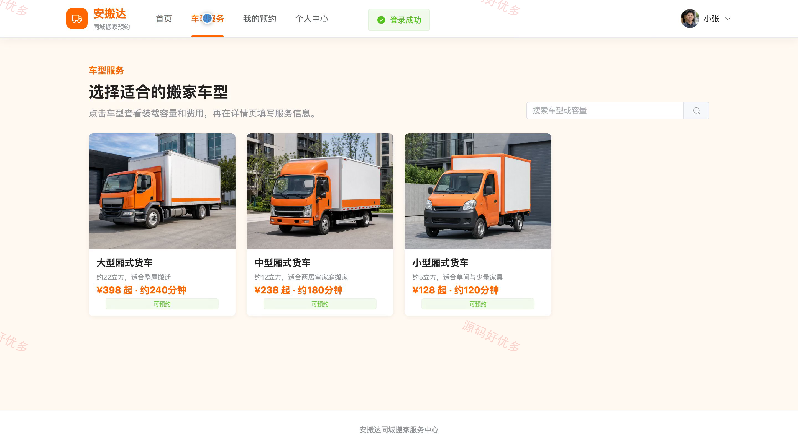
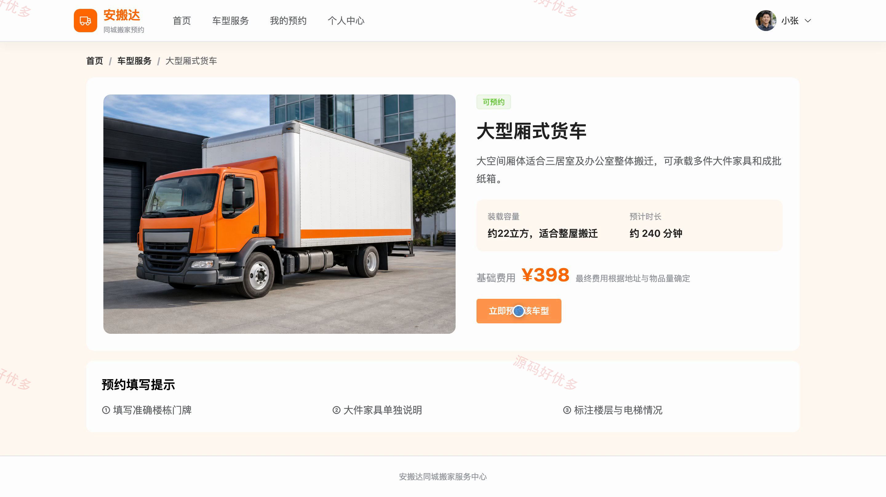
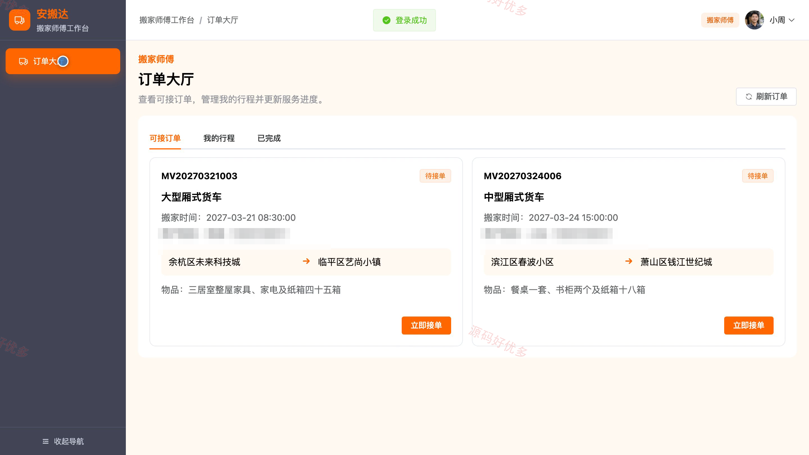
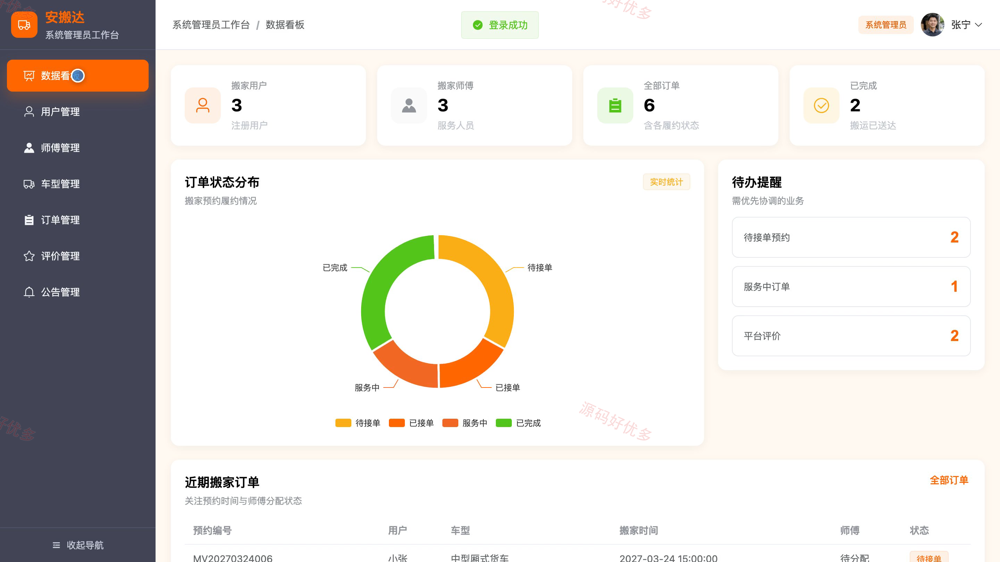
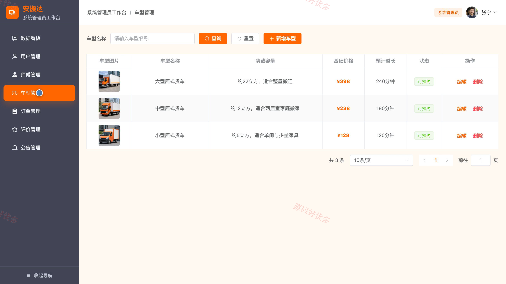
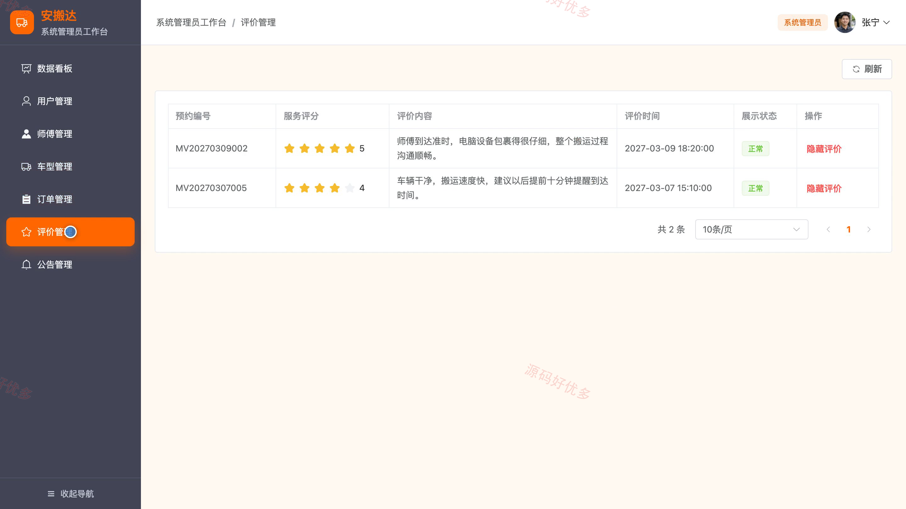

# bs087A
bs087A同城搬家预约服务平台
## 源码问题查看主页咨询

### 一、关键词
同城搬家预约、搬家服务平台、搬家车型预订、搬家师傅接单、搬家订单管理

### 二、作品包含
源码+数据库+万字设计文档+PPT+全套环境和工具资源+本地部署教程

### 三、项目技术
前端技术： Html、Css、Js、Vue3.4、Element-Plus
后端技术：Java、SpringBoot3.2.0、MyBatis-Plus

### 四、运行环境（以下版本亲测，其他版本兼容性请自行测试）
开发工具：IDEA/eclipse + VSCODE

数据库：MySQL5.7+（共12张表）

数据库管理工具：Navicat10以上版本

环境配置软件： JDK17 + Maven

前端Nodejs：16+

浏览器：谷歌浏览器

### 五、项目介绍
项目编号：bs087A

同城搬家预约服务平台面向搬家用户、搬家师傅和系统管理员，提供车型选择、搬家预约、师傅接单、履约进度、服务评价与后台运营管理等同城搬家服务。

角色：搬家用户、搬家师傅、系统管理员

搬家用户功能：搬家车型浏览与筛选、车型详情及费用查看、搬家信息填写与预约提交、预约订单与履约进度查询、待接单预约取消、已完成服务评价、平台公告查看、个人资料与密码维护。

搬家师傅功能：可接订单查看与接单、个人搬家行程管理、服务进度更新、订单异常反馈、已完成订单及用户评价查看、个人资料维护。

系统管理员功能：平台运营数据看板、搬家用户管理、搬家师傅管理、服务车型管理、搬家订单协调与师傅分配、服务评价管理、平台公告管理、个人资料维护。

### 六、运行截图

